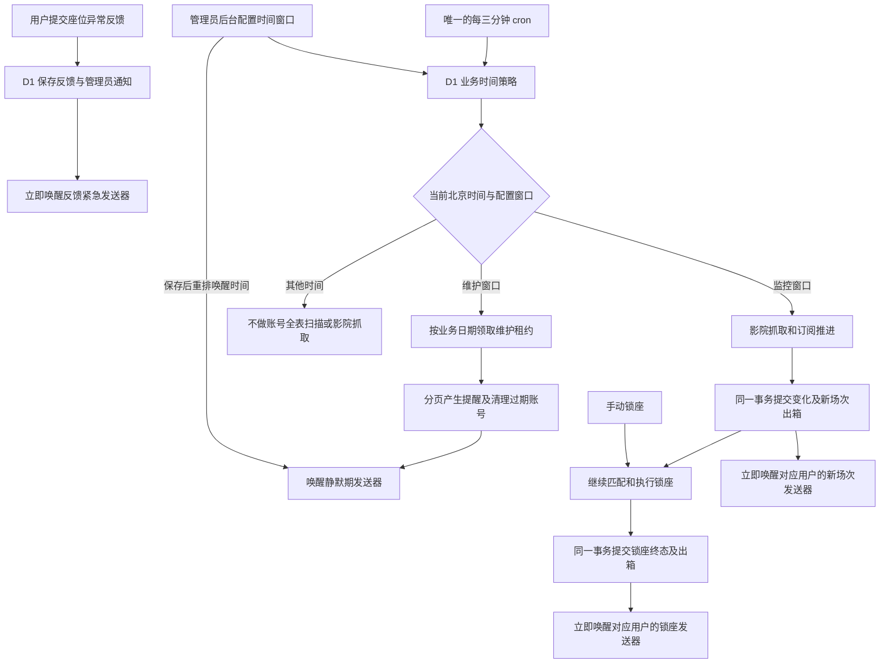
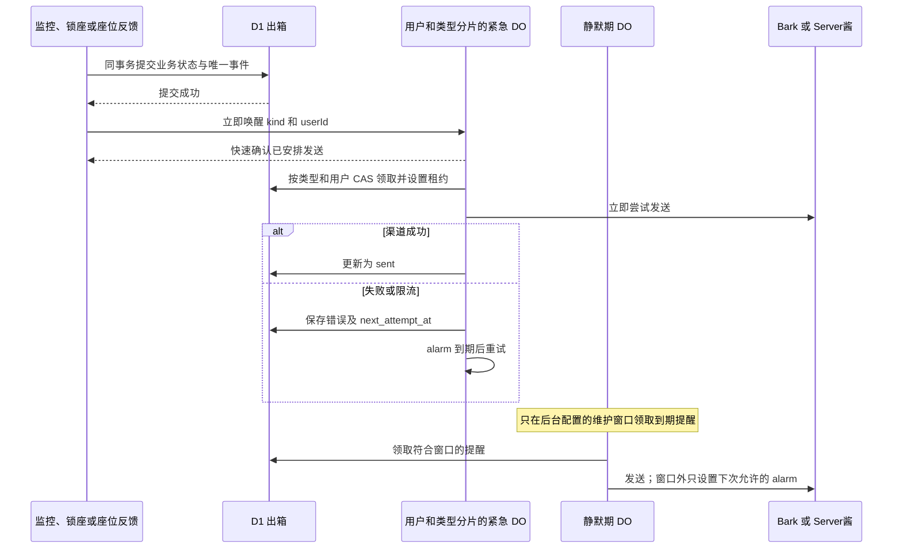

# 猫眼监控、账号维护与通知调度设计

设计日期：2026-09-23（北京时间）。本次修订：2026-09-23，纳入管理员可配置业务窗口、座位反馈即时推送和 DO/D1 职责说明。

状态：架构已由用户人工复核并批准开发；本文描述本次代码改动，不代表当前线上已部署。生产 D1 迁移和 Worker 发布仍须按部署步骤执行。

## 改动范围

- 猫眼业务：定时影院检查、锁座终态、座位反馈、账号到期提醒、三十天归档和撤销清理的时间准入及通知发送。
- 管理后台：猫眼监控与维护窗口设置、通知和维护进度展示；用户页面只同步展示当前监控窗口。
- 基础设施：沿用 `tools-api` Worker 和现有 DO 绑定，统一为一条三分钟 cron；生产 D1 只做保留旧数据的加法迁移。
- 不涉及 Store 业务时段、用户个人监控频率、外部推送渠道协议或锁座下单规则。

## 目标与选择

- 保留现有 `tools-api` Worker 和唯一的 `*/3 * * * *` 业务 cron；不新增消息 Worker、Queue 或按 cron 表达式识别业务的映射表。
- 监控发现新场次、锁座产生终态、用户提交座位异常反馈后立即尝试推送，不等待下次 cron，也不与账号到期提醒共用串行发送通道。
- 到期提醒、三十天归档和撤销清理只在账号维护窗口运行；普通提醒只在该窗口发送，不占监控和锁座发送机会。
- 维持 D1 `notification_outbox` 为通知事实来源。`event_key` 去重、领取租约、重试与失败记录继续有效。

本期选择在同一 Worker 内按 `(kind, userId)` 创建紧急通知 Durable Object 实例，并保留一个独立的常规通知实例。D1 保存管理员时间策略、业务进度和 `notification_outbox` 消息记录，可持久查询、去重和按事务更新；DO 负责按键串行协调、即时唤醒、发送和 alarm 重试，不能把仅存于 DO 内存的队列当成通知事实来源。写入 D1 出箱后马上唤醒 DO，不等下次 cron：这里的“入队”是可靠留档，不是延迟发送。增加第二个 Worker 主要有独立部署价值，并不会缩短三分钟的发现周期或提升外部渠道吞吐，故不作为本期范围。

## 时间与准入

管理员在猫眼后台配置监控和账号维护两个北京时间窗口，D1 `maoyan_business_policy` 单行保存起止分钟、版本和更新时间。服务端对两个窗口做合法性与不重叠校验，以 `expectedVersion` 条件更新并记录审计；后台提供时间输入、当前生效时段与保存失败提示。监控窗口可以跨午夜；维护窗口限制在同一自然日，以免提醒的业务日期歧义。窗口使用 `Asia/Shanghai` 半开区间，默认值见下表。cron 始终是 `*/3 * * * *`，不靠表达式区分业务，也不因管理员改窗口而部署。

| 业务 | 北京时间 | 允许的动作 |
| --- | --- | --- |
| 监控和等待中锁座 | 默认 `[07:00, 23:00)`，管理员可改 | 启动新的影院检查；已启动的批次可以跨过关窗时间完成 |
| 账号维护 | 默认 `[01:00, 02:00)`，管理员可改 | 分页产生提醒、处理三十天归档和撤销清理；同一业务日期成功完成一次 |
| 紧急通知 | 全天 | `new-shows`、`lock-terminal`、`seat-feedback` 入库后立即首次尝试，失败可跨窗口重试 |
| 常规通知 | 使用管理员配置的账号维护窗口 | `account-expiry` 只在该窗口领取和发送 |

手动检查仍按现有 API 权限、去抖和业务状态处理，不因监控定时窗口关闭而禁用；其产生的有效新场次通知同样走紧急通道。手动锁座的终态全天推送。通知资格先按 `kind` 和业务窗口判断，再在可发送的同一通道内排序；数字优先级不能越过窗口限制。“积压三十分钟”只能改变重试/补偿频率，不能把到期提醒带入监控时段。

每次 cron 和常规 DO 领取前从 D1 读取生效策略，不在对象或 Worker 内跨请求缓存旧窗口；读不到合法策略时暂停启动新的定时业务及常规发送并报警，紧急通知不依赖窗口继续处理。保存设置后唤醒 routine DO 重新安排 alarm；若新维护窗口当下已开放，下一 cron 执行维护，积压提醒可立即发送。进入新批次时以实际时间和当次读到的策略判断窗口，不用延迟触发的计划时间冒充当前时间；计划时间仍可用于批次去重。关窗或管理员变更策略时不再启动新监控批次，变更前已接纳的批次继续完成锁座与通知。以默认 23:00 为例，22:59 接纳、23:01 提交的新场次仍在 23:01 唤醒紧急通道。紧急发送不再检查当前是否处于监控窗口；发送前仍检查账户、订阅版本、渠道与消息本身是否有效。常规通道在关窗后不领取下一条；已交给外部渠道的请求不能撤回，靠窗口边界前的发送缓冲减少越界完成。

## 业务与推送流程

主路径在每个订阅的新场次出箱事务提交后唤醒新场次通道，不能等同影院的全部锁座完成。锁座终态及其出箱一起提交后立即唤醒锁座通道。用户座位反馈与管理员通知出箱同事务落 D1，再立即唤醒管理员的 `seat-feedback` 紧急通道，全天首次尝试；推送失败不抹掉反馈记录。手动反馈 API 只在反馈及出箱持久化成功时返回 `recorded: true`，持久化失败返回错误，渠道发送失败仍由出箱重试。自动检测的反馈沿用当日去重，不阻断锁座主流程，也走即时通道。DO 收到唤醒时先持久化身份及备用 alarm，再在同一次 `fetch` 中启动有异常收口的 drain Promise，随后快速确认；不能等待最多十五秒的外部渠道调用完成。[DO 的未完成 I/O 会维持对象活动，`waitUntil` 不会延长其生命周期](https://developers.cloudflare.com/durable-objects/api/state/#waituntil)，而已持久化的 [alarm](https://developers.cloudflare.com/durable-objects/api/alarms/) 负责进程中断后的恢复和后续重试，不能充当正常首发的唯一触发。若唤醒根本没有到达，出箱仍为待处理，后续 cron 做轻量补偿。

各紧急通道按类型和用户分片，一位用户的慢推送不阻塞别人的锁座结果或管理员反馈；同一用户、同一类型仍串行。共享的渠道凭据和提供方限流无法通过分片消除；尊重 `429` 和 `Retry-After`，常规提醒不在监控时段占用渠道。锁座不排在新场次的内部发送队列后，但不能抢占渠道已受理的请求，也不承诺提供方共享额度下的绝对优先权。`event_key` 保证只建一条出箱记录，D1 条件更新保证同一租约只被一方领取；若渠道已接受请求而写回 `sent` 失败，仍可能重复推送，不能宣称外部精确一次。

## 账号维护与自然日

账号是否到期仍由 `expires_at` 的实际时刻决定，不等待维护任务。提醒根据北京时间的到期**自然日**计算：“前一天”只在到期日期减一的本地日期生成和发送；保留现有三天提醒与到期提醒种类、凭据校验和 `userId + expiresAt + stage` 事件键。同日维护失败后续跑仍可生成这条提醒；若整个前一日都未完成维护，不在到期日发送冒充“提前一天”的旧提醒，而是暴露漏发状态并在账号实际到期后处理 `expired` 阶段。已有 `one-day` 行若积压到下一自然日，发送器标记其过时并跳过。续期、撤销或归档后，出箱中的旧提醒须在领取及发送时重新校验，不把过时提醒送出。

维护分别为提醒、三十天归档和撤销清理保存 `(job, localDate)` 完成状态、租约与分页游标。每次 cron 在配置窗口内处理有界页，先处理当日提醒；全部分页完成才标记该任务当天成功。维护窗口结束仍未完成时保留游标、记录未完成并报警，停止当日维护；下一维护窗口先处理新日期的有效提醒，再续跑旧日期未完成的归档、清理和已到期通知。旧日期的一天前/三天前提醒不补发，按当前期限及日期重判阶段。容量验收要求按当前配置窗口内可触发的批次数跑完各任务；窗口过短或连续超量时显示风险并报警，不承诺无条件一天内完成。三十天归档和撤销清理依然受原有业务版本及条件保护。若 cron 被停用或配置到完全错过维护窗口，无法承诺自然日前提醒；看板暴露最近成功业务日期，外部健康检查据此报警。同一条已停用的 cron 无法自行发现并报告自己的停用。

## 兼容、迁移与观测

- 当前工作区有尚未提交的“每日 02:00 第二条 cron + 单 DO 为常规通知留名额”草稿。实施时只替换与本设计冲突的改动，保留同文件内其他有效变更和所有无关工作区内容。
- 旧监控后备路径 `check.js` 仍同步直推。它必须改为带稳定事件键的出箱写入，并使快照推进与事件记录一致；入队只能记为“待发送”，不能写成“已推送”。避免新旧路径在切换期对同一事件双发。
- 现有锁座后备直推也要覆盖；用户主动发起的“测试推送”保留同步结果，以便页面直接展示渠道验证成功或失败，但它不占后台业务发送队列。
- 旧 `main` 通知 DO 的 alarm 退出时不得删除 pending/sending 行；新通道通过原有租约和条件更新接手。正式 D1 用加法迁移增加用户分片的紧急索引、按类型和到期时间扫描的常规索引、业务时间策略与维护进度表；`pending` 和租约到期的 `sending` 分别查询、分别建索引，不重建或清空生产数据库。后台猫眼设置与用户端监控时段文案读取同一策略。更新部署文档中“不支持原地升级”的旧说明后再上线。
- 仪表盘按消息类型展示待发送、失败和最老等待时长，另观测发现、入队、首次尝试、送达四个时间点及维护最后成功日期。出箱新增可空的 `detected_at`、`first_attempt_at`、`sent_at`；`detected_at` 是确认变化时的实际时间，`created_at` 是实际入队时间，`first_attempt_at` 在调用渠道前记录。旧行缺失的时间保留为未知，不用计划触发时间冒充发现时间。关注 DO 时长、D1 读写和渠道 `429`，但不因常规提醒积压暂停有效监控。

## 验收与待复核值

验收覆盖默认及管理员修改后的开关窗边界、跨午夜监控与晚触发、策略变更时跨窗已接纳监控批次、维护窗口迁移时 routine alarm 重排、前一自然日、同日维护失败续跑、用户反馈全天即时尝试且提交确认以落档为准、慢新场次不挡其他用户锁座、常规提醒窗口外零发送和 alarm 不忙轮询、旧队列接管及渠道限流。监控发现仍可能等待下一次三分钟批次；“实时”指变化/锁座终态/反馈持久化后立即开始首次发送尝试，外部送达时间不作保证。

本设计采用以下默认值与规则供人工复核：监控初始 `07:00-22:59`、账号维护及到期提醒初始 `01:00-01:59`，实际时段由管理员后台调整；三十分钟兜底不突破当前配置的维护窗口；`seat-feedback` 属全天紧急通知。确认这些规则后才进入实现。
